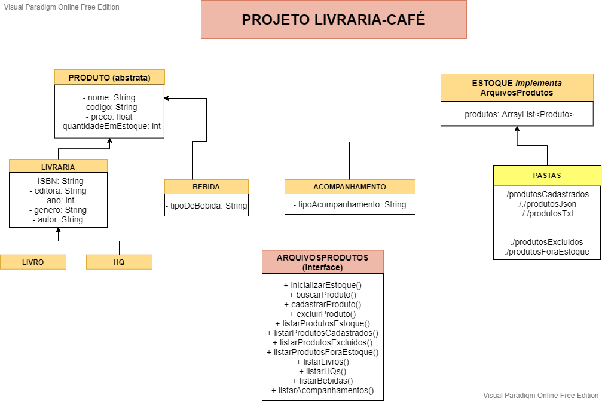
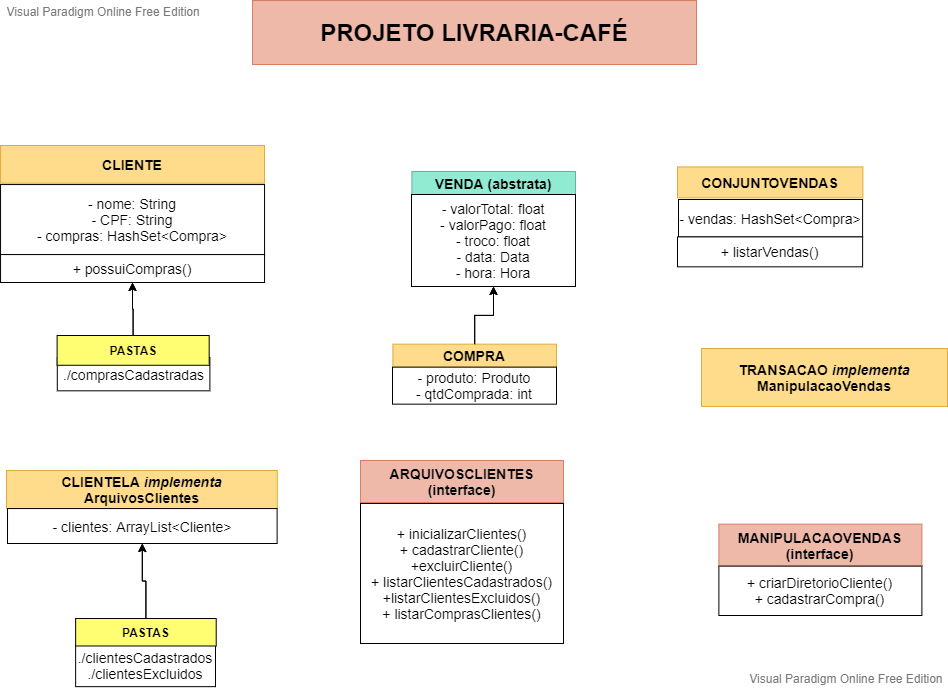

# CafeEtLettres-LivrariaCafe

### Alunas:
Any Caroliny Souza Silva  
Letícia Cena dos Santos  

### Tipo de loja
Livraria-café

Nome do estabelecimento: Cafe et letters  
Produtos: livros, alimentícios (bebidas e acompanhamentos)  

### Especificações:
• Listar todos os produtos cadastrados  
• Listar os produtos disponíveis no estoque  
• Listar produtos por categorias  
• Listar produtos por categorias  
• Listar produtos excluídos ou fora do estoque  
• Listar produtos excluídos ou fora do estoque  
• Aumentar a quantidade de produtos no estoque  
• Cadastrar/excluir um cliente  
• Listar os clientes cadastrados e excluídos  
• Cadastrar vendas  
• Listar todas as vendas  
• Listar compras de um determinado cliente  

### Ferramentas de implementação:
Linguagem: Java  
IDEs: Netbeans, Eclipse, VSCode  
Padrão de projeto: Modelo-Visão-Controle (MVC)  

### UML do Escopo

### UML das Regras de Negócio

### Distribuição de tarefas:
#### Semana 1 (20/06 - 26/06)
Modelagem do escopo (M)

#### Semana 2 (27/06 - 03/07)
Swing (V)
Criação e inserção em Arquivos (C)

#### Semana 3 (04/07 - 10/07)
Remoção em Arquivos e Listagem (C)

#### Semana 4 (11/07 - 14/07)
Resolver possíveis ajustes nas regras de negócio (C)  
Aprimorar usabilidade da interface com o usuário (V)  
